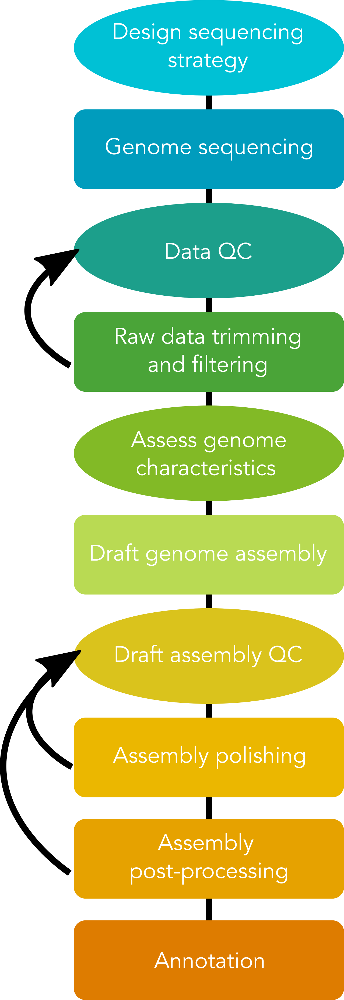
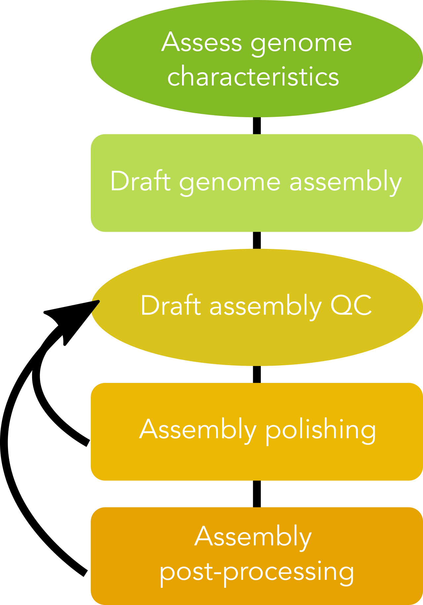



 Murray, can you remove the teaching/objectives and the key points boxes please? Also, figures aren't working properly in the final version, I'm not sure of correct syntax etc here. 

While genome assembly typically consists of a straightforward series of processes, it requires many choices at each step in the process. These choices include: sequencing type, sequence coverage depth, trimming and filtering parameters, genome assembly program, and downstream steps including polishing, scaffolding, and more. Many of these choices will be determined in part by the biological characteristics of the focal species and the target application(s) for the genome assembly.

Today we will assemble a small fungal genome using Oxford Nanopore Technologies long-read sequencing data in combination with Illumina short-read data. While we assemble this genome, we will consider the impacts of characteristics of the input data on each of the steps in the process. 

An essential first step in working with sequencing data is raw read quality assessment, followed by appropriate trimming and filtering. For the purposes of today's workshop, both long-read and short-read input data have been pre-processed through trimming and filtering steps to remove sequencing adapters and poor-quality sequences. Four subsets of data have been produced. We will work in groups to investigate the characteristics of these data sets, and the impacts of these characteristics on genome assembly quality at various stages of the pipeline.

This workshop has been designed to run on the NeSI compute infrastructure. All data and software has already been set up for you to use during the workshop.
