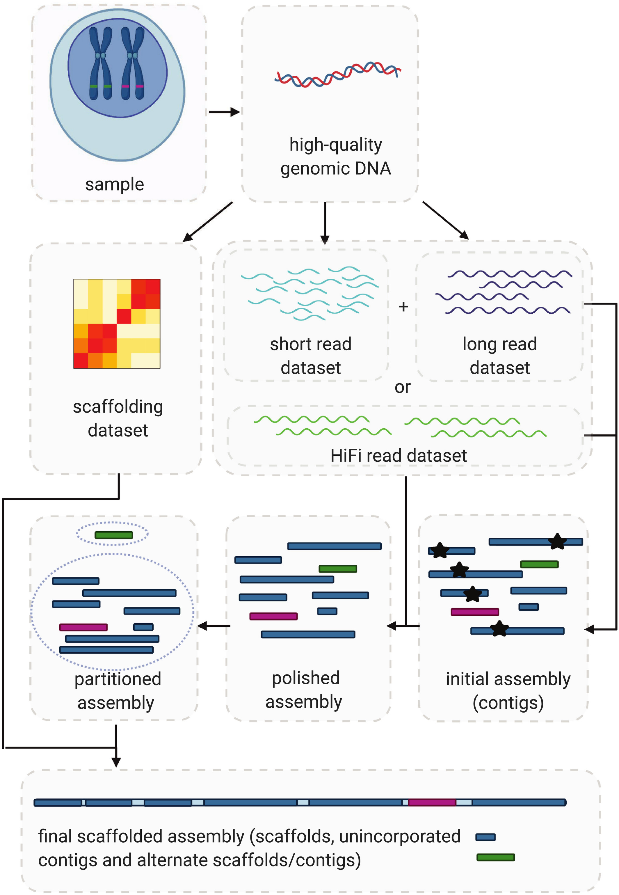
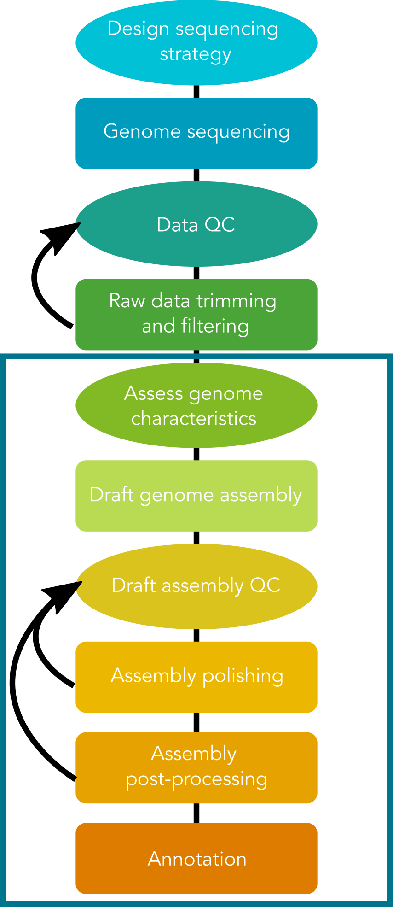



## 1.1 What is a reference genome assembly?

As genome sequencing and bioinformatic tools and technologies have rapidly developed in recent decades, we can now produce high-quality **reference genome assemblies** for species of interest. While a **genome** is the full complement of DNA characterising an individual organism and is inherent to all living beings, a reference genome is a tool used for research. A reference genome is the representative genome of a species. that can be used alone for interspecific comparisons or as a reference against which population-level resequencing or reduced-representation sequencing data can be aligned for high-quality variant calling for intra- or inter-specific comparisons. Further, reference genomes act as catalogues of gene coding sequences and other functional components, opening the door to a wide variety of biological applications.

> ## Short reads vs. long reads
> **Short-read sequencing** typically uses Illumina DNA sequencing platforms to produce reads with length < 500 bp. Relatively small input DNA quantities are required, which makes short-read sequencing more accessible. 
> 
> **Long-read sequencing** uses platforms such as Oxford Nanopore Technologies or PacBio SMRT to produce reads with length >10,000 bp. Despite initial relatively low quality, ONT sequencing has experienced myriad improvements in wet-lab protocols, sequencing technology, and bioinformatic processing, resulting in sequencing data that is competitive with that of the more expensive high-quality PacBio HiFi data. Large amounts (micrograms) of high molecular weight intact DNA are required for these sequencing types. PacBio platforms are not yet available in Aotearoa, which may be a limiting factor for sequencing projects with taonga focal species. 
>
> While all genome assemblies are imperfect, reference genomes built purely from short-read data are prone to assembly errors due in part to the challenges associated with assembling long and complex repetitive sequences, or correctly assembling large structural variants. Such errors can result in incomplete genome assemblies, false variant detection, and incorrect gene annotation. Knowing these short-comings, long-read sequencing is now considered almost essential for producing high-quality genome assemblies.  
{: .callout}

## 1.2 Steps in the genome assembly process

While genome assembly typically consists of a straightforward series of processes, it requires many choices at each step in the process. These choices include: sequencing type, sequence coverage depth, trimming and filtering parameters, genome assembly program, and downstream steps including polishing, scaffolding, and more. Many of these choices will be determined in part by the biological characteristics of the focal species and the target application(s) for the genome assembly.

<figure>

<figcaption align = "center"><b>A typical genome assembly workflow. Whibley et al. 2021, Molecular Ecology Resources, https://doi.org/10.1111/1755-0998.13312.</b></figcaption>
</figure>

Today we will assemble a small fungal genome using Oxford Nanopore Technologies long-read sequencing data in combination with Illumina short-read data. While we assemble this genome, we will consider the impacts of characteristics of the input data on each of the steps in the process. 

An essential first step in working with sequencing data is raw read quality assessment, followed by appropriate trimming and filtering. For the purposes of today's workshop, both long-read and short-read input data have been pre-processed through trimming and filtering steps to remove sequencing adapters and poor-quality sequences. Four subsets of data have been produced. We will work in groups to investigate the characteristics of these data sets, and the impacts of these characteristics on genome assembly quality at various stages of the pipeline.

This workshop has been designed to run on the NeSI compute infrastructure. All data and software has already been set up for you to use during the workshop.
