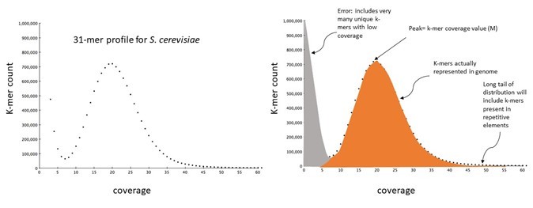
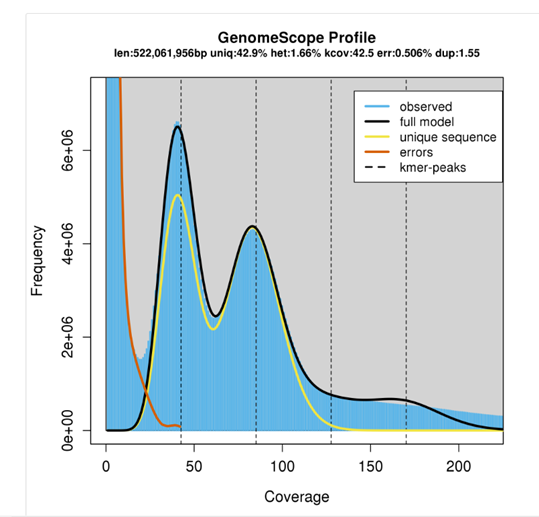
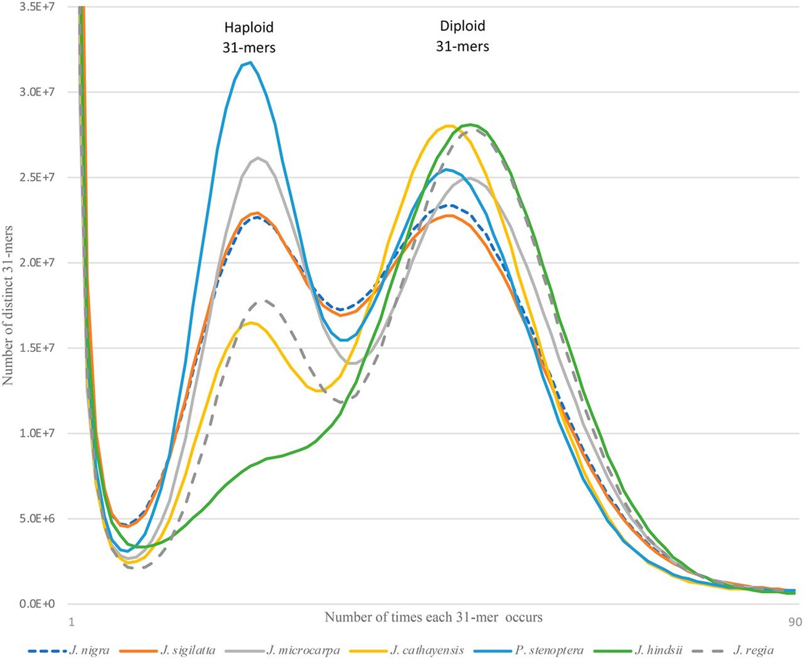



## 3.1 Background and setup

It is getting easier and cheaper to sequence and assemble genomes. However, at the start of a genome project very little may be known about the genome properties of your organism of interest. Take genome size, for example. The amount and types of sequencing you would do, and the choice of assembly software will all be influenced by this parameter. There are 3 main approaches to obtaining a genome size estimate: 
  1. If you are lucky to be working on a system where flow cytometry has been performed to quantify the amount of DNA (in picograms) in the nucleus of the cells of your organism, then you will have an estimate of genome size and ploidy to set alongside your draft sequence assembly. Such estimates are not always available, however. 
  2.  You might take a best guess, based on what is known about related taxa. In some cases this will be helpful. Birds, for example, display relatively little interspecific variation in genome size (typically 1.3 Gb, reported range from 1-2.1 Gb).  In other cases, genome size can vary considerably: plant genome sizes range from 0.063 Gb (the carnivorous plant Genlisea) to 149 Gb (*Paris japonica*, in the Order Liliales) and often closely related taxa may have quite different genome sizes. Ploidy variation is also common and can have a major impact on genome size.
  3. Genome size can be estimated from unassembled and relatively low coverage short-read sequence data using k-mer profiles. We will explore this approach today.

This simple equation relates genome size to the amount of sequence data in an experiment and the coverage (which here means the average number of times that you have sequenced a base in the genome): 

  Genome size (G) = Total number of bases sequenced (T) / genome sequence coverage (N)

> ## Exercise
> 
> If you obtain 10 million read pairs (i.e. 2 x 100 bp reads) of whole genome sequence data for the plant *Arabidopsis thaliana* (genome size 120 Mb), what would the expected mean coverage be?
>
>> ## Solution
>> 
>> ~16X 
>> 
>> 10,000,000 reads x 200 bp reads = 2,000,000,000 bp = T.
>> 
>> T / G = N 
>> 
>> 2,000,000,000 bp / 120,000,000 bp = 16.67X coverage. 
> {: .solution}
{: .challenge}


Before we start, let's move into the `genome_assembly` directory and consider what data has been provided for today's workshop. First, take a look at the directory structure, what data has been provided, and make a new directory for results outputs. Using the `ls -l` command displays the files in a list, with additional information.

```
cd ~/obss_2022/genome_assembly/
ls 
ls -l data/ 
mkdir results/
```

> ## Exercise
> 
> What can you tell about the input data at first glance?
>
>> ## Solution
>> 
>> The input data is all in FASTQ format, which we have used previously in OBSS sessions.
>> 
>> There are two main data types: Illumina (short-read sequencing data) and ONT (Oxford Nanopore Technologies long-read sequencing data). 
> {: .solution}
{: .challenge}

## 3.2 Input data quality assessment

Our raw data has been pre-processed, so let's first get an overview of the quality and metrics of these processed data. For our Nanopore long-read data, there are specific tools that can assess quality and other metrics. One example is the program [NanoStat](https://github.com/wdecoster/nanostat). 

As we saw earlier, we can use SLURM to submit scripts to the queue, which allows us to perform multiple processes simultaneously. Let's navigate to the `scripts` directory and make a SLURM script to assess our Nanopore data.

```
cd ~/obss_2022/genome_assembly/scripts/
nano nanostat.sl
```

Copy the script below into the new file. Here you want to assess only the dataset that you are using in your assembly, so you will need to replace the `*` in the input and output filenames to one of A-E. 

```
#!/bin/bash -e

#SBATCH --account=nesi02659
#SBATCH --job-name=nanostat
#SBATCH --output=%x.%j.out
#SBATCH --error=%x.%j.err
#SBATCH --time=12:00
#SBATCH --mem=1G

module purge
module load NanoStat 

cd ~/obss_2022/genome_assembly/data/

# replace * with one of A-E
NanoStat --fastq all_trimmed_ont_*.fastq -t1 > ~/obss_2022/genome_assembly/results/Nanostat_all_trimmed_ont_*
```

One benefit of using NeSI is that many commonly-used programs are pre-installed via modules. We use `module purge` to clear the module space before loading the modules we need for the job using the `module load` command. 

Save the script and run it using `sbatch nanostat.sl`.

While NanoStat runs, we can use FastQC to assess the Illumina short read data in the same way that we used it yesterday. 

```
module load FastQC

cd results/

fastqc ~/obss_2022/genome_assembly/data/All_trimmed_illumina.fastq
```

Once FastQC has finished, check your queue to see whether NanoStat is still running, using `squeue -u <nesi.id>`. If it's finished, use `less` to check your `.err` and `.out` logs in the `scripts` directory for any issues.

Now take a look at the results for FastQC and NanoStat, and discuss the overall metrics and quality with your neighbour. How do our short-read and long-read data sets differ from one another? 

## 3.3 Genome size estimation and k-mer profiles

> ## What are k-mers and k-mer profiles?
>A **k-mer** is a substring of length k.  
>
>The maximum number of unique k-mers is given by 4<sup>k</sup>.
>
>The numbers of k-mers contained within a sequence of length L is given by the equation L – K +1, where L is the length of sequence and K is the k-mer length.
>A **k-mer profile** is a histogram in which the counts of the occurrences of each unique k-mer in the dataset are plotted. The x-axis shows the count of k-mer occurrence, often termed **coverage** or **depth**, and the y-axis the number of distinct k-mers which report that coverage/depth value.
{: .callout}

> ## Exercise
> 
> Consider the following 10bp sequence:
> 
>   GTAGAGCTGT 
>   
> Calculate how many 3-mers there are in this sequence using the equation L - K + 1. What are all the possible 3-mer sequences?
>
>> ## Solution
>> When L = 10 and K = 3: L - K + 1 = 10 - 3 + 1 = 8.
>> 
>> There are 8 3-mers in the sequence:
>> 
>>  GTA, TAG, AGA, GAG, AGC, GCT, CTG, TGT
> {: .solution}
{: .challenge}

K-mers have some convenient properties for computational biology: There are a finite number of distinct k-mers and the counting of these can be based on unambiguous matching. K-mer profiles for genome property estimation are usually 17-31 bases long. As k-mer length increases the likelihood of it occurring uniquely in your genome increases, but so does the chance that it will overlap a sequence error. Although 4<sup>k</sup> quickly becomes very large as k increases, the proportion of the total possible number of unique k-mers that are actually present in a genome decreases.

> ## A typical k-mer profile
>
> 
{: .callout}

As we saw earlier, we can calculate G (genome size) using the equation G = T / N. However, at the outset of our analyses, we often only have a value for T. 

We can obtain an estimate of the genome sequence coverage (N) by looking at the k-mer coverage, a property that can be calculated from unassembled reads in the following way:
	
$$  
N = \frac{M * L}{L - K + 1}
$$

Where:
- N = genome sequence coverage  
-	M = the k-mer coverage (the peak of coverage on the k-mer profile plot)  
-	L = read length  
-	K = k-mer length  


By estimating N in this way, we can combine it with our knowledge of T to obtain an estimate of G.

This approach to genome size estimation was proposed in the Giant Panda genome project, a landmark paper as it describes the first genome assembly to be generated from only short read Illumina sequencing (Li R, Fan W, Tian G, et al. 2010. The sequence and de novo assembly of the giant panda genome. *Nature*. [doi:10.1038/nature08696](https://doi.org/10.1038/nature08696)). 

We are going to use our processed Illumina short-read data to count k-mers that can be used to explore some characteristics of the sequenced genome, using a program called Jellyfish with our short-read data. Let's navigate back to our `scripts` directory, and create a new script.

```
cd ../scripts/
nano jellyfish.sl
```

Copy the script below into your `jellyfish.sl` file.

```
#!/bin/bash -e
#SBATCH --job-name=jellyfish
#SBATCH --output=%x.%j.out
#SBATCH --error=%x.%j.err
#SBATCH --time=05:00
#SBATCH --mem=4G
#SBATCH --cpus-per-task=10 
#SBATCH --account=nesi02659

module purge
module load Jellyfish/2.3.0-gimkl-2020a

cd ~/obss_2022/genome_assembly/results/

# count 21-mers from read dataset
jellyfish count -C -m 21 -s 1G -t 10 -o kmer_21_illumina_reads.jf ~/obss_2022/genome_assembly/data/All_trimmed_illumina.fastq

# generate histogram of kmer counts
jellyfish histo -t 10 kmer_21_illumina_reads.jf  > jf_reads.histo
```

> ## Exercise
> ### **Question 1**
>
> First, let's look at the SLURM resources. What can you tell about this job?
>
> Now let's examine how the script is navigating the directory structure. Where is the job being processed? Are any other paths included in this job?
>
>> ## Solution
>> The job will run for no more than 5 minutes, and will use up to 4 GB memory and 10 CPUs. We have given the job the name `jellyfish` as an identifier. It will run under the account code for OBSS workshop.
>>
>> The job is being processed in the directory `~/obss_2022/genome_assembly/results/`. The other path listed in the job is directing jellyfish to the input FASTQ data.
>>
>>
> {: .solution}
>
>
>Then let's look at the commands we'll be passing to Jellyfish. There are two steps to this process:
>  1. Jellyfish counts the k-mers
>  2. Jellyfish computes the histogram of these counts. 
>
> As you can see, there are a number of different parameters used, denoted by `-`. A key part of bioinformatics is building familiarity with program manuals. These are often but not always hosted on GitHub, and provide information about program installation and usage. 
>
> ### **Question 2**
> 
> If we know that Jellyfish is used to count k-mers, can you use Google to find the manual?
>> ## Solution
>> By googling 'jellyfish genome k-mers', you should be able to find the manual at <https://github.com/gmarcais/Jellyfish>. 
> {: .solution}
{: .challenge}

Let's save our `jellyfish.sl` file, and run it.

```
sbatch jellyfish.sl
```

We can check where our job is in the queue using `squeue -u <nesi.id>`. Then when the job finishes, we can check our log files to see if there are any problems or errors. 

```
less jellyfish.*.out
less jellyfish.*.err
```

Check what outputs have been written to your `results` directory.

```
ls ../results/
```

To visualise the results of k-mer analysis, import your `.histo` file produced by Jellyfish into the [GenomeScope](http://qb.cshl.edu/genomescope/) webtool. Note: The input reads were produced from 150 bp Illumina sequencing.

What can you tell from these results, and how do your results compare to the examples at <https://www.nature.com/articles/s41467-020-14998-3/figures/1>?

## 3.4 Heterozygosity and k-mers

K-mer analyses can become more difficult in heterozygous diploid samples (and even more so for polyploids!). The challenge here is in correctly partitioning the k-mers that are derived from heterozygous and repetitive components of the genome. There are tools, such as [GenomeScope](http://qb.cshl.edu/genomescope/), that model these different components of the profile and estimate genome properties.  

The example below is for a pear genome. The profile left hand peak has a coverage of 0.5x the right hand peak. K-mers under the right peak are those sequences that are shared between both alleles at a locus, whereas sequence variants will change the identity of the k-mers that overlap these variants.



> ## Exercise
> The figure below is reproduced from Stevens et al. (2018; *G3: Genes, Genomes, Genetics*; 8:7, <https://doi.org/10.1534/g3.118.200030>). The authors present k-mer profiles for six different walnut (Juglans) species.
> 
> 
> 
> | **Key** ||||
> |---|---|---|---| 
> |*J. nigra* |	Dashed blue	| *P. stenoptera*	| Solid blue |
> |*J. sigillata* |	Orange	| *J. hindsii*	| Green |
> |*J. microcarpa* |	Solid grey | 	*J. regia* | Dashed grey |
> |*J. cathayensis* |	Yellow | | | 		
>
> Which of the species is (i) the most heterozygous and (ii) the least heterozygous? 
> 
>> ## Solution
>> i)	*P. stenoptera*, ii)	*J. hindsii* (based on the relative proportion in diploid vs haploid peaks).
> {: .solution}
{: .challenge}


Question 4: Which of the species is (i) the most heterozygous and (ii) the least heterozygous ? 
