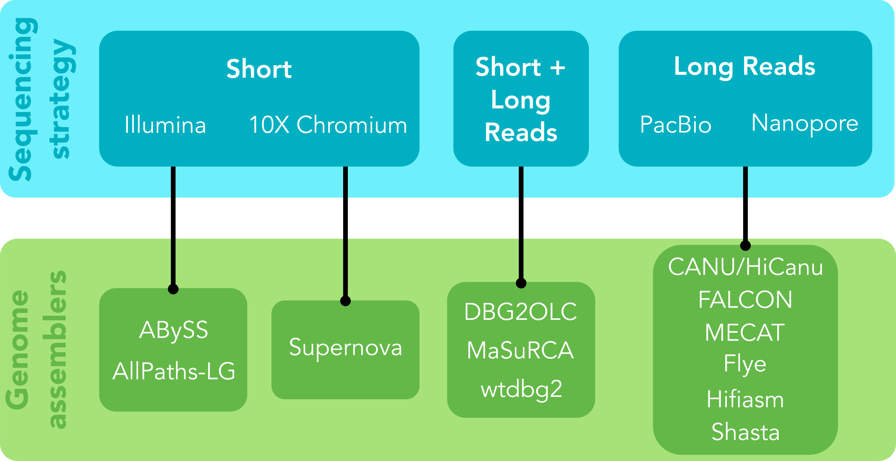



## 4.1 Genome assembly options

A wide (and continually expanding) range of genome assembly tools are available. Many assemblers are designed for specific data types (e.g., short- vs long-reads, Nanopore vs PacBio data). It is important to select an assembler that is appropriate to the data type(s) and characteristics of the focal genome. Becoming familiar with genome assembly manuals and associated research can be helpful in understanding the strengths and weaknesses of the underlying algorithms implemented by the various assembly program.



## 4.2 Assembling a genome

Today we will be using [Flye](https://github.com/fenderglass/Flye), an assembler designed to work with long-read data. Flye has modes for Nanopore and PacBio long-read data, that take into account the characteristics specific to each data type. We will use the `--nano-raw` mode to pass just our Nanopore data (labelled 'ont'). 

Although genome assembly algorithms are complex, using an assembler is typically very straightforward. Let's make the script `flye.sl`, containing the content below.

```
#!/bin/bash -e

#SBATCH --job-name=FLYE
#SBATCH --account=nesi02659
#SBATCH --output=%x.%j.flye.out
#SBATCH --error=%x.%j.flye.err
#SBATCH --time=2:00:00
#SBATCH --mem=70G
#SBATCH --ntasks=1
#SBATCH --nodes=1
#SBATCH --cpus-per-task=32 

module purge
module load Flye/2.9.1-gimkl-2022a-Python-3.10.5

# Change * to your group's dataset
flye --nano-raw ~/obss_2022/genome_assembly/data/all_trimmed_ont_*.fastq --out-dir ~/obss_2022/genome_assembly/results/flye_raw_* -t 24
```

As you can see from the SLURM resources, we expect this job to take around 2 hrs to run, so let's check back later.

## 4.3 Later...


> ## Exercise
> First, let's check out `.err` and `.out` logs for Flye. Were there any issues? What can you tell about the process? What can you tell about the genome assembly? 
>> ## Solution
>> Take careful note of any ERROR messages. The logs describe the various processes implemented by Flye, and make some comments about the data along the way. At the end of the log there is a print-out of some brief assembly summary metrics, that will likely vary between groups. 
> {: .solution}
{: .challenge}


Now let's investigate the outputs.

```
ls -lt ~/obss_2022/genome_assembly/results/flye_raw_*/
```

You should see a directory that looks like this:
```
  `-flye.log
  `-assembly_info.txt
  `-assembly.fasta
  `-assembly_graph.gfa
  `-assembly_graph.gv
  `-params.json
  |-40-polishing/
  |-30-contigger/
  |-20-repeat/
  |-10-consensus/
  |-00-assembly/    
```

It's always important to check the log files for any other errors that may have occurred, or provide more details on resources used, or data characteristics. Flye logs contain very descriptive information about every step in the assembly process. This kind of transparent processing is valuable. You can see that a brief summary of these logs was printed to our `.err` file. If we jump to the end of the Flye log, we can see it prints the output directory contents, along with the brief summary of assembly statistics included in our `.err` file. 

Most importantly, we can see there is a file called `assembly.fasta`. This contains the genome assembly produced by Flye in FASTA format. Let's take a quick look at its contents.

```
head ~/obss_2022/genome_assembly/results/flye_raw_*/assembly.fasta
```

As expected for a FASTA file, we can see a header line denoted by `>` followed by a sequence line representing an assembled contig.

Congratulations, you've assembled a genome! But wait, there's more...
