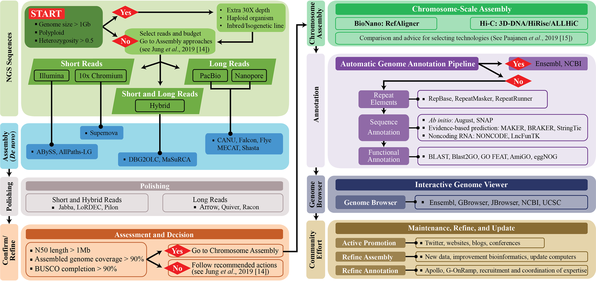



The genome assembly produced at this stage is still in draft form, and there are several ways we can make improvements to it. It is good practice to compare assembly metrics at the end of each step in these processes to see whether the assembly is continuing to improve. The first step for assemblies produced with Nanopore data is assembly polishing.

## 6.1 Long-read polishing

Nanopore data is really useful for genome assembly due to the length of the reads produced, meaning it is easier to piece the genome together into contiguous scaffolds. However, Nanopore data has a higher rate of sequencing error than other data types like Illumina or PacBio HiFi. Polishing is a process where reads are mapped against the assembly to identify errors which can then be corrected using the consensus of the mapped data. 

We will first perform polishing using the Nanopore data itself, using the program [Medaka](https://github.com/nanoporetech/medaka). Let's make a script for Medaka using `nano medaka.sl`. 

```
#!/bin/bash -e

#SBATCH --job-name=medaka
#SBATCH --account=nesi02659
#SBATCH --output=%x.%j.out
#SBATCH --error=%x.%j.err
#SBATCH --time=1:00:00
#SBATCH --mem=12G
#SBATCH --ntasks=1
#SBATCH --cpus-per-task=4
#SBATCH --gpus-per-node A100:1

module purge
module load medaka/1.6.0-Miniconda3-4.12.0

cd ~/obss_2022/genome_assembly/results/

medaka_consensus -i ~/obss_2022/genome_assembly/data/all_trimmed_ont_*.fastq.gz -d flye_raw_*/assembly.fasta -o medaka_polish  -t 4 -m r941_min_sup_g507
```

It is good practice to compare assembly metrics at the end of each step in these processes to see whether the assembly is continuing to improve. In the interests of time, today we will just use our `assemblathon_stats.pl` script to collect metrics, and run BUSCO once more at the end of our polishing steps.

## 6.2 Short-read polishing

After polishing the assembly with the Nanopore long reads, we can also leverage the high-quality Illumina short read data to perform additional polishing. We will do this with [Pilon](https://github.com/broadinstitute/pilon/wiki). To run Pilon we need both the assembly FASTA file, and a BAM file of the short reads mapped to the assembly. You can read more about the various parameters in the Pilon usage guide. To make the BAM file, create a new script called `make_bam.sl`, and copy in the script below.

```
#!/bin/bash -e

#SBATCH --job-name=samtools
#SBATCH --account=nesi02659
#SBATCH --output=%x.%j.out
#SBATCH --error=%x.%j.err
#SBATCH --time=40:00
#SBATCH --mem=8G
#SBATCH --ntasks=1
#SBATCH --cpus-per-task=4

module purge
module load BWA SAMtools

cd ~/obss_2022/genome_assembly/results/medaka_polish/

# step 1. index assembly
bwa index consensus.fasta

cd ~/obss_2022/genome_assembly/results/

# step 2. map short reads
bwa mem medaka_polish/consensus.fasta ~/obss_2022/genome_assembly/data/All_trimmed_illumina.fastq.gz > illumina_trimmed_mapped_to_medaka_consensus.sam

# step 3. sort mapped reads
samtools sort  -@ 8 -o illumina_trimmed_mapped_to_medaka_consensus.sorted.bam illumina_trimmed_mapped_to_medaka_consensus.sam

# step 4. make index of sorted mapped reads
samtools index illumina_trimmed_mapped_to_medaka_consensus.sorted.bam
```

There are four steps in this process that use the programs `BWA` and `SAMtools`:
  1. `bwa index` creates an index of the assembly so it can be read by `bwa mem`
  2. `bwa mem` is used to map the Illumina reads to the Medaka polished assembly
  3. `samtools sort` sorts the mapped reads by coordinate (their location in the assembly)
  4. `samtools index` creates an index of the sorted mapped reads for rapid access by Pilon

While this runs, we can prepare the script for Pilon polishing. Make a new file called `pilon.sl`, and copy the following script into it. 

```
#!/bin/bash -e

#SBATCH --job-name=pilon
#SBATCH --account=nesi02659
#SBATCH --output=%x.%j.pilon.out
#SBATCH --error=%x.%j.pilon.err
#SBATCH --time=20:00
#SBATCH --mem=18G
#SBATCH --ntasks=1
#SBATCH --cpus-per-task=16 

module purge
module load  Pilon/1.24-Java-15.0.2

cd ~/obss_2022/genome_assembly/results/

java -Xmx16G -jar $EBROOTPILON/pilon.jar \
    --genome medaka_polish/consensus.fasta \
    --frags illumina_trimmed_mapped_to_medaka_consensus.sorted.bam \
    --changes --vcf --diploid --threads 16 \
    --output medaka_pilon_polish1 \
    --minmq 30 \
    --minqual 30
```

Use `assemblathon_stats.pl` to investigate how polishing has impacted the basic assembly metrics. We can also modify our `BUSCO.sl` script to compare the gene completeness of this polished version of the assembly with our original draft. To do this, change the input directory and assembly filename to the Pilon output, and change the BUSCO output filename.

For both long- and short-read polishing, you may find a genome assembly can benefit from multiple rounds of polishing, with continued improvements in the assembly metrics.

## 6.3 Downstream processes

Today we have produced a fungal draft genome assembly. You can see that there are a number of steps in the process, and that many choices must be made along the way, based on input data types, genome characteristics of the focal organism, and the quality of the assembly produced. 

While we've done a lot of work to get to produce this draft assembly, there is still more that can be done before a genome is published or used for downstream research. Take a look at the detailed workflow below. Which steps did we complete today? How many more steps could we work through? A lot of work goes into producing a high-quality genome assembly! 

<figure>

<figcaption align = "center"><b>A detailed workflow describing the processes and decision-making in a genome assembly workflow. Note the additional complexity compared with the visualisation in the Introduction. Jung et al. 2020, PLoS Computation Biology, <a href="https://doi.org/10.1111/1755-0998.13312">https://doi.org/10.1111/1755-0998.13312</a>.</b></figcaption>
</figure>
